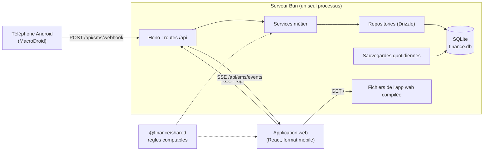

# Architecture

## Vue d'ensemble



En production, un seul processus Bun sert à la fois l'API et l'application web compilée, sur la même origine : pas de CORS, un seul port. En développement, Vite sert l'application web et redirige `/api` vers le backend.

## Organisation du dépôt

Un monorepo avec les workspaces Bun :

| Dossier | Paquet | Rôle |
|---|---|---|
| `backend/` | `finance-app-backend` | API Hono, base SQLite, parser SMS, tests unitaires |
| `web/` | `finance-app-web` | Application React (Vite, Tailwind CSS v4, Framer Motion, Zustand) |
| `shared/` | `@finance/shared` | Code commun au backend et au web : catégories système, règles comptables |
| `e2e/` | `finance-app-e2e` | Tests end-to-end Playwright |

## Stack technique

| Couche | Choix | Raison |
|---|---|---|
| Runtime | Bun | Exécute TypeScript directement ; SQLite intégré (`bun:sqlite`) ; installations et tests rapides |
| Serveur HTTP | Hono | Léger, typé, SSE natif (`streamSSE`), service de fichiers statiques pour Bun |
| Base de données | SQLite en mode WAL | Un seul fichier, facile à sauvegarder et à auto-héberger |
| ORM et migrations | Drizzle ORM et drizzle-kit | Schéma typé qui sert de source unique ; migrations SQL versionnées |
| Frontend | React 19, Vite 6 | |
| Styles et animations | Tailwind CSS v4, Framer Motion | Interface mobile : fenêtres glissantes, transitions |
| État client | Zustand | Un store par domaine, sans surcouche |
| Icônes | Solar Icons | |
| Tests | `bun test`, Playwright | Unitaires et invariants sur une base en mémoire ; end-to-end sur un navigateur mobile |

## Backend

### Couches

```
backend/src/
├── index.ts           Démarrage : base, jeton, sauvegardes, serveur
├── app.ts             Application Hono : middlewares, routes, fichiers statiques, erreurs
├── routes/            Traduction HTTP <-> services (validation des entrées, codes de retour)
├── services/          Logique métier
│   ├── ledgerService.ts        Effets comptables et atomicité
│   ├── transactionService.ts   Saisie manuelle et modification d'opérations
│   ├── savingsService.ts       Versements et déblocages d'épargne
│   ├── budgetService.ts        Affectation et réaffectation des enveloppes
│   ├── smsService.ts           Enregistrement d'un SMS (doublons, comptes, solde)
│   ├── smsParser.ts            Analyse des SMS par expressions régulières
│   ├── autoCategorizer.ts      Catégorie selon le type d'opération
│   ├── statsService.ts         Bilans mensuels et historique
│   └── backupService.ts        Sauvegardes SQLite
├── db/
│   ├── schema.ts      Schéma Drizzle (source unique)
│   ├── index.ts       Connexion, migrations, withTransaction()
│   ├── seed.ts        Primitives système (catégories, réglages par défaut)
│   └── repositories/  Accès aux tables, sans logique métier
├── lib/
│   ├── auth.ts        Jeton d'accès
│   ├── errors.ts      HttpError et traduction des erreurs en JSON
│   ├── validation.ts  Validation des entrées (montants entiers, énumérations, dates)
│   ├── time.ts        Fuseau de l'application, périodes mensuelles
│   └── format.ts
└── scripts/backup.ts  Sauvegarde manuelle
```

Chaque couche a un rôle précis :
- Une **route** ne contient pas de logique métier : elle valide les entrées, appelle un service et renvoie la réponse.
- Un **service** applique les règles métier et décide des transactions SQLite.
- Un **repository** ne fait que lire et écrire.

### Atomicité et cohérence comptable

Toute écriture qui touche à l'argent passe par `withTransaction()`, qui s'appuie sur `Database.transaction` de `bun:sqlite`. Les appels imbriqués utilisent des savepoints. Si une étape échoue, rien n'est écrit.

`ledgerService` calcule une seule fois les effets d'une opération sur les soldes :
- `record()` enregistre l'opération et applique ses effets ;
- `remove()` applique leur inverse exact.

Création et suppression sont donc toujours symétriques. Le détail des effets est dans [DATA_MODEL.md](DATA_MODEL.md#effets-sur-les-soldes).

### Erreurs

Les services lèvent des `HttpError` (400 validation, 404 introuvable, 409 conflit métier, 422 SMS non reconnu). Un gestionnaire unique les traduit en `{ "error": "message lisible" }`, et fait de même pour les JSON invalides (400) et les violations de contraintes SQLite (409). Une erreur imprévue renvoie un 500 générique, et le détail n'apparaît que dans les journaux du serveur.

### Authentification

Toutes les routes `/api/*` exigent le jeton d'accès, au choix :
- dans l'en-tête `Authorization: Bearer <jeton>` ;
- dans l'en-tête `X-Access-Token` ;
- dans le paramètre `?token=`, nécessaire pour `EventSource` et pratique pour les webhooks.

La comparaison se fait en temps constant. Le jeton vient de `APP_ACCESS_TOKEN`, sinon d'un fichier `.access-token` généré au premier démarrage à côté de la base. `/health` reste public, pour les sondes de disponibilité.

### Temps réel

`GET /api/sms/events` ouvre un flux Server-Sent Events :

- **Événements** : `connected` à l'ouverture, `ping` toutes les 10 secondes, et `NEW_SMS_TRANSACTION` à chaque SMS enregistré. Ce dernier contient l'opération, le résultat de l'analyse, les enveloppes candidates et l'indicateur de choix d'enveloppe.
- **Côté client** (`web/src/services/smsListener.ts`) :
  - le flux est reconnecté si aucun signal n'arrive pendant 35 secondes ou en cas d'erreur ;
  - toutes les données sont resynchronisées quand l'application revient au premier plan ou que le réseau revient.

### Fuseau horaire

`APP_UTC_OFFSET_MINUTES` vaut 180 par défaut (Madagascar, sans heure d'été). Il sert à deux choses :
- convertir l'heure des SMS en UTC ;
- découper les périodes mensuelles côté serveur (`periodBounds`).

Le client découpe jours et mois selon l'heure de l'appareil (`web/src/utils/dates.ts`).

### Sauvegardes

`backupService` crée un instantané cohérent avec `VACUUM INTO`, qui gère correctement le mode WAL :
- au démarrage, si la dernière sauvegarde a plus de 24 heures ;
- puis toutes les 24 heures.

Les copies au-delà de `BACKUP_RETENTION` (30 par défaut) sont supprimées.

## Référence de l'API

Toutes les routes sont préfixées par `/api` et demandent le jeton. Les corps sont en JSON.

### Accès et réglages

| Méthode | Route | Description |
|---|---|---|
| GET | `/auth/check` | Vérifie le jeton |
| GET | `/settings` | Profil et réglages (`hasGeminiApiKey`, jamais la clé) |
| PUT | `/settings` | Mise à jour partielle. `geminiApiKey: ""` efface la clé |

### Comptes

| Méthode | Route | Description |
|---|---|---|
| GET | `/wallets` | Comptes avec `virtualLocked` et `spendableBalance` |
| GET | `/wallets/:id` | Un compte |
| POST | `/wallets` | Création (`name`, `type`, `accountNumber`, `balance`, `isSpendable`) |
| POST | `/wallets/batch-init` | Initialisation à l'onboarding (refusée si un historique existe) |
| POST | `/wallets/:id/adjust` | Réajustement du solde (`newBalance`) |
| DELETE | `/wallets/:id` | Suppression (refusée si le compte est référencé) |

### Opérations

| Méthode | Route | Description |
|---|---|---|
| GET | `/transactions` | Toutes les opérations, les plus récentes d'abord. Options : `?month=YYYY-MM`, `?limit=N` |
| GET | `/transactions/:id` | Une opération |
| POST | `/transactions` | Saisie manuelle : `flow`, `operationType`, `walletId`, `destinationWalletId`, `categoryId`, `budgetId`, `amount`, `feeAmount`, `title`, `date`, `note`, `location`, `items` |
| PUT | `/transactions/:id` | Modifie `categoryId`, `budgetId`, `title`, `note` |
| DELETE | `/transactions/:id` | Suppression, avec annulation des effets |

### Catégories et enveloppes

| Méthode | Route | Description |
|---|---|---|
| GET, POST | `/categories` | Liste, création |
| GET, PUT, DELETE | `/categories/:id` | Détail, modification, suppression (protégées pour le système ou si utilisées) |
| GET, POST | `/budgets` | Liste, création (`name`, `monthlyLimit`, `categoryIds`, `isEssential`, `isFixed`, `color`, `icon`) |
| GET, PUT, DELETE | `/budgets/:id` | Détail, modification, suppression. Réaffecte les opérations du mois en cours |

### Épargne

| Méthode | Route | Description |
|---|---|---|
| GET, POST | `/savings` | Pots (avec part réservée et part libre), création |
| GET, PUT, DELETE | `/savings/:id` | Détail avec objectifs, renommage et apparence, suppression si vide |
| POST | `/savings/:id/deposit` | Versement (`amount`, `sourceWalletId`, `note`) |
| POST | `/savings/:id/withdraw` | Déblocage de la part libre (`amount`, `destinationWalletId`, `note`) |
| GET, POST | `/savings-goals` | Objectifs, création |
| GET, PUT, DELETE | `/savings-goals/:id` | Détail, modification (hors montant accumulé), suppression |
| POST | `/savings-goals/:id/contribute` | Versement ou déblocage ciblé (`amount`, `action`: `DEPOSIT` ou `WITHDRAW`, `sourceWalletId`) |

### SMS, statistiques et données

| Méthode | Route | Description |
|---|---|---|
| POST | `/sms/webhook` | Enregistre un SMS (`message`, `sender`, `timestamp` facultatif). 201, ou 200 avec `duplicate: true` |
| POST | `/sms/test-parse` | Analyse un SMS sans rien enregistrer |
| GET | `/sms/events` | Flux temps réel (SSE) |
| GET | `/stats/monthly-savings?period=YYYY-MM` | Bilan par enveloppe |
| GET | `/stats/history?months=N` | Revenus, dépenses et épargne des N derniers mois |
| GET | `/data/export` | Export JSON complet, sans secret |

## Frontend

### Organisation

```
web/src/
├── App.tsx            Accès, onboarding, navigation par onglets, fenêtres globales
├── components/
│   ├── views/         Écrans : Tableau de bord, Historique, Budgets, Paramètres, Notifications
│   ├── sheets/        Fenêtres glissantes : saisie rapide, détail, enveloppe, épargne, etc.
│   ├── onboarding/    Déverrouillage et premier lancement
│   ├── layout/        Barre d'onglets, bouton d'ajout
│   ├── common/        Composants génériques (cartes groupées, icônes, confirmation, notifications)
│   ├── dashboard/, transactions/
├── stores/            Un store Zustand par domaine, plus sync.ts (rechargement groupé)
├── services/          Client API, écoute temps réel, calcul des frais
├── utils/             Formatage, dates locales, erreurs
└── types/models.ts    Types partagés avec l'API
```

### Flux de données

- `services/api.ts` centralise les appels :
  - ajout du jeton ;
  - traduction des erreurs en messages lisibles ;
  - retour à l'écran de déverrouillage sur une réponse 401.
- Les stores de chargement affichent eux-mêmes leurs erreurs. Les actions d'écriture renvoient un résultat, ou lèvent une erreur que l'écran affiche dans une notification (`utils/errors.ts`).
- Après une écriture qui touche l'argent, `refreshLedger()` recharge les comptes, l'épargne et l'historique. Après une modification d'enveloppe, l'historique est rechargé, car le serveur a pu réaffecter des opérations du mois.
- Tous les agrégats (dépensé, dépensé par enveloppe, filtres de l'historique) utilisent les règles de `@finance/shared`. Les chiffres de l'application sont donc identiques à ceux du serveur.

## Qualité et intégration continue

| Niveau | Outil | Ce qui est vérifié |
|---|---|---|
| Types | `tsc` sur chaque paquet | Typage strict de tout le dépôt |
| Migrations | `drizzle-kit generate` | Le schéma et les migrations committées sont synchronisés |
| Unitaires et invariants | `bun test` sur une base en mémoire | Parser SMS, symétrie des effets, atomicité, doublons, fuseau horaire, enveloppes, intégrité, accès |
| End-to-end | Playwright (Pixel 7, fuseau de Madagascar) | Parcours complets sur l'application compilée, contre une base neuve |
| Image | Docker + test de fumée | Démarrage, accès protégé, persistance du volume, sauvegarde |

Le pipeline complet est décrit dans `.github/workflows/ci.yml`. Le déploiement n'a lieu qu'après la réussite de toutes les étapes.

## Image Docker

`Dockerfile` en trois étapes :
1. **build** : installation complète et compilation de l'application web ;
2. **dépendances de production** : installation sans les dépendances de développement ;
3. **exécution** : image `oven/bun` slim, utilisateur non privilégié, volume `/data` (base, jeton généré, sauvegardes), port 4880, et vérification de santé sur `/health`.
