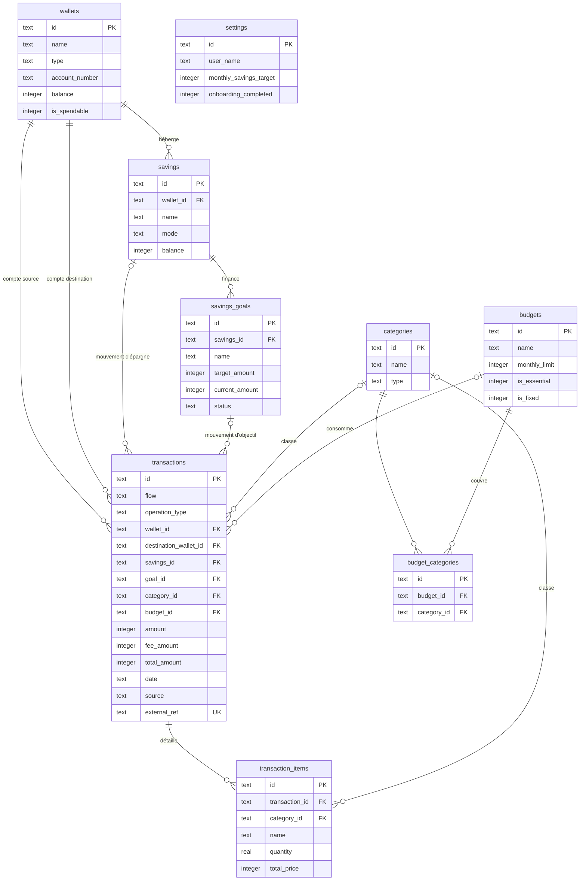

# Modèle de données

La base est un fichier SQLite unique. Le schéma est défini **uniquement** dans `backend/src/db/schema.ts` (Drizzle ORM). Les migrations SQL de `backend/drizzle/` en sont générées, puis appliquées automatiquement au démarrage du serveur.

## Conventions

- **Identifiants** : texte. UUID v4 pour les entités créées par l'application, identifiants stables pour les catégories système (`cat_food_groceries`, etc.).
- **Montants** : entiers en Ariary (`integer`). Pas de centimes et pas de nombres flottants pour l'argent. Seules les quantités d'articles et les coordonnées GPS sont des réels.
- **Dates des opérations** : chaînes ISO 8601 en UTC (`2026-09-25T07:32:00.000Z`). Elles se comparent donc correctement comme du texte. Les découpages par jour et par mois se font en heure locale.
- **Horodatages techniques** (`created_at`, `updated_at`) : millisecondes depuis l'époque Unix.
- **Booléens** : entiers `0` ou `1`.
- **Contraintes d'intégrité** : SQLite est configuré avec `PRAGMA foreign_keys = ON`. Chaque clé étrangère déclare explicitement son comportement à la suppression.

## Diagramme

## Tables

### `wallets` : comptes réels

| Colonne | Type | Contraintes | Description |
|---|---|---|---|
| `id` | text | clé primaire | Identifiant |
| `name` | text | non nul | Nom affiché |
| `type` | text | non nul, défaut `CUSTOM` | `MVOLA`, `ORANGE_MONEY`, `AIRTEL_MONEY`, `CASH`, `BANK`, `CUSTOM` |
| `account_number` | text | | Numéro du compte. Pour le Mobile Money, sert à reconnaître les transferts vers soi-même (comparaison sur les 9 derniers chiffres) |
| `balance` | integer | non nul, défaut 0 | Solde réel courant |
| `is_spendable` | integer | non nul, défaut 1 | Compté dans le disponible |
| `created_at`, `updated_at` | integer | non nul | |

### `savings` : pots d'épargne

| Colonne | Type | Contraintes | Description |
|---|---|---|---|
| `id` | text | clé primaire | |
| `wallet_id` | text | non nul, vers `wallets.id`, suppression **restreinte** | Compte de rattachement |
| `name` | text | non nul | |
| `mode` | text | non nul, défaut `VIRTUAL_LOCK` | `VIRTUAL_LOCK` (l'argent reste dans le solde du compte) ou `NATIVE` (l'argent est hors du compte) |
| `balance` | integer | non nul, défaut 0 | Montant épargné, jamais négatif |
| `color`, `icon` | text | non nul | Apparence |
| `created_at`, `updated_at` | integer | non nul | |

### `savings_goals` : objectifs

| Colonne | Type | Contraintes | Description |
|---|---|---|---|
| `id` | text | clé primaire | |
| `savings_id` | text | non nul, vers `savings.id`, suppression en **cascade** | Pot qui finance l'objectif |
| `name` | text | non nul | |
| `target_amount` | integer | non nul | Montant cible |
| `current_amount` | integer | non nul, défaut 0 | Montant réservé dans le pot |
| `deadline` | text | | Échéance ISO |
| `priority` | text | non nul, défaut `MEDIUM` | `LOW`, `MEDIUM`, `HIGH` |
| `status` | text | non nul, défaut `IN_PROGRESS` | `IN_PROGRESS`, `COMPLETED`, `ARCHIVED` |
| `color`, `icon` | text | non nul | |
| `note` | text | | |
| `created_at`, `updated_at` | integer | non nul | |

### `categories`

| Colonne | Type | Contraintes | Description |
|---|---|---|---|
| `id` | text | clé primaire | `cat_*` pour les 16 catégories système |
| `name` | text | non nul | |
| `type` | text | non nul, défaut `EXPENSE` | `EXPENSE` ou `INCOME` |
| `color`, `icon` | text | non nul | L'icône est le nom d'un composant Solar Icons |
| `created_at` | integer | non nul | |

Les catégories système sont définies dans `shared/src/categories.ts`, et réinsérées si besoin à chaque démarrage.

### `budgets` : enveloppes

| Colonne | Type | Contraintes | Description |
|---|---|---|---|
| `id` | text | clé primaire | |
| `name` | text | non nul | |
| `monthly_limit` | integer | non nul, défaut 0 | Plafond mensuel (0 = enveloppe sans plafond) |
| `color`, `icon` | text | non nul | |
| `is_essential` | integer | non nul, défaut 0 | Besoin vital |
| `is_fixed` | integer | non nul, défaut 0 | Montant fixe chaque mois |
| `created_at`, `updated_at` | integer | non nul | L'ordre de création détermine l'enveloppe par défaut |

### `budget_categories` : catégories couvertes par une enveloppe

| Colonne | Type | Contraintes |
|---|---|---|
| `id` | text | clé primaire |
| `budget_id` | text | non nul, vers `budgets.id`, suppression en **cascade** |
| `category_id` | text | non nul, vers `categories.id`, suppression en **cascade** |
| `created_at` | integer | non nul |

Un index unique porte sur `(budget_id, category_id)`. Une même catégorie peut appartenir à plusieurs enveloppes.

### `transactions` : grand livre

| Colonne | Type | Contraintes | Description |
|---|---|---|---|
| `id` | text | clé primaire | |
| `flow` | text | non nul | `DEBIT` ou `CREDIT` |
| `operation_type` | text | non nul | Voir [types d'opération](#types-dopération) |
| `wallet_id` | text | non nul, vers `wallets.id`, **restreinte** | Compte source (débit) ou crédité (crédit) |
| `destination_wallet_id` | text | vers `wallets.id`, **restreinte** | Compte destination d'un transfert interne |
| `savings_id` | text | vers `savings.id`, **mise à null** | Pot concerné par un mouvement d'épargne |
| `goal_id` | text | vers `savings_goals.id`, **mise à null** | Objectif concerné |
| `category_id` | text | vers `categories.id`, **restreinte** | Catégorie (absente pour l'épargne) |
| `budget_id` | text | vers `budgets.id`, **mise à null** | Enveloppe consommée |
| `amount` | integer | non nul | Montant principal, strictement positif |
| `fee_amount` | integer | non nul, défaut 0 | Frais (débits uniquement) |
| `total_amount` | integer | non nul | `amount + fee_amount`, calculé par le serveur |
| `title` | text | non nul | |
| `recipient`, `sender` | text | | Tiers, par exemple « NOM (03XXXXXXXX) » |
| `date` | text | non nul | Date de l'opération, ISO UTC |
| `note` | text | | |
| `source` | text | non nul, défaut `MANUAL` | `MANUAL`, `SMS_AUTO`, `VOICE`, `IMAGE_OCR` |
| `external_ref` | text | **unique** | Référence opérateur (`MVOLA:1234567890`) : garantit qu'un SMS n'est enregistré qu'une fois |
| `place_name`, `latitude`, `longitude` | text, real, real | | Lieu facultatif |
| `created_at`, `updated_at` | integer | non nul | |

Index : `date`, `wallet_id`, `budget_id`, et l'index unique sur `external_ref`.

### `transaction_items` : articles d'un ticket

| Colonne | Type | Contraintes |
|---|---|---|
| `id` | text | clé primaire |
| `transaction_id` | text | non nul, vers `transactions.id`, suppression en **cascade** |
| `category_id` | text | vers `categories.id`, mise à null |
| `name` | text | non nul |
| `quantity` | real | non nul, défaut 1 |
| `unit_price` | integer | |
| `total_price` | integer | non nul |
| `unit` | text | |
| `created_at` | integer | non nul |

### `settings` : profil et réglages (une ligne, `id = 'default'`)

| Colonne | Type | Description |
|---|---|---|
| `user_name`, `user_profession`, `user_location` | text | Profil |
| `monthly_income_target`, `monthly_savings_target` | integer | Objectifs mensuels |
| `currency` | text | `MGA` |
| `onboarding_completed` | integer | Premier lancement terminé |
| `gemini_api_key` | text | Clé IA. Jamais renvoyée par l'API, qui expose seulement `hasGeminiApiKey` |
| `sms_capture_enabled`, `push_notifications_enabled` | integer | Réservés |
| `created_at`, `updated_at` | integer | |

## Types d'opération

| `operation_type` | Sens | Origine | Usage |
|---|---|---|---|
| `EXPENSE_GENERAL` | débit | saisie | Dépense courante |
| `TRANSFER_P2P` | débit | SMS, saisie | Envoi à un tiers, ou transfert entre ses comptes si `destination_wallet_id` est renseigné |
| `WITHDRAWAL_CASH` | débit | SMS, saisie | Retrait vers le compte Espèces (toujours un transfert interne) |
| `TOPUP_AIRTIME` | débit | SMS, API | Achat de crédit |
| `MERCHANT_PAYMENT` | débit | SMS, API | Paiement marchand |
| `BILL_PAYMENT` | débit | API | Paiement de facture |
| `INCOME_TRANSFER` | crédit | SMS, saisie | Argent reçu |
| `SALARY` | crédit | API | Salaire |
| `DEPOSIT_CASH` | crédit | API | Dépôt d'espèces sur un compte |
| `SAVINGS_DEPOSIT` | débit | routes d'épargne | Versement vers un pot ou un objectif |
| `SAVINGS_WITHDRAWAL` | crédit | routes d'épargne | Déblocage depuis un pot ou un objectif |
| `BALANCE_ADJUSTMENT` | | réservé | Neutre : ni dépense, ni revenu |

La route générique `POST /api/transactions` refuse les types d'épargne, qui passent obligatoirement par les routes dédiées. Elle vérifie aussi que le type correspond au sens.

## Effets sur les soldes

Les soldes (`wallets.balance`, `savings.balance`, `savings_goals.current_amount`) sont stockés, pour être lus rapidement. Leur cohérence est garantie par une règle unique (`backend/src/services/ledgerService.ts`) :

- à la **création**, on applique les effets de l'opération ;
- à la **suppression**, on applique exactement leur inverse ;
- les deux se font dans une même transaction SQLite.

| Opération | Comptes | Pot | Objectif |
|---|---|---|---|
| Débit sans destination | source − (montant + frais) | | |
| Débit avec destination (transfert interne, retrait) | source − (montant + frais), destination + montant | | |
| Crédit | compte + montant | | |
| Versement, pot virtuel, même compte | aucun | + montant | + montant si objectif |
| Versement, pot virtuel, autre compte | source − montant, compte du pot + montant | + montant | + montant si objectif |
| Versement, pot natif | source − montant | + montant | + montant si objectif |
| Déblocage, pot virtuel | compte du pot − montant, destination + montant (si différente) | − montant | − montant si objectif |
| Déblocage, pot natif | destination (ou compte du pot) + montant | − montant | − montant si objectif |

Si un effet ferait passer un pot ou un objectif en négatif, ou sous le total réservé aux objectifs, toute l'opération est annulée.

**Exception : les SMS.** Après application des effets, le solde du compte opérateur est remplacé par le solde annoncé dans le SMS, si ce SMS est le plus récent pour ce compte. S'il est arrivé en retard, le solde d'avant est rétabli, car il inclut déjà l'opération.

## Invariants garantis

- Une opération non-épargne a toujours une catégorie, dont le type correspond à son sens.
- `total_amount = amount + fee_amount`. Les montants sont des entiers, et `amount > 0`.
- `budget_id`, s'il est renseigné, désigne une enveloppe qui couvre la catégorie de l'opération : c'est vérifié à l'écriture, et réaligné quand les enveloppes du mois changent.
- Un SMS (référence opérateur) n'est enregistré qu'une fois.
- La somme des `current_amount` des objectifs d'un pot ne dépasse jamais le solde du pot.
- On ne peut supprimer ni un compte référencé par une opération ou un pot, ni une catégorie utilisée, ni une catégorie système, ni un pot non vide.

Ces invariants sont couverts par `backend/test/ledger.test.ts`.

## Faire évoluer le schéma

1. Modifier `backend/src/db/schema.ts`.
2. Générer la migration : `cd backend && bun run db:generate`.
3. Vérifier le SQL généré dans `backend/drizzle/`, puis le committer avec le schéma.

La CI échoue si le schéma a changé sans migration correspondante. Au démarrage, une base créée par l'ancien schéma non versionné (antérieur aux migrations) est refusée avec un message explicite.
